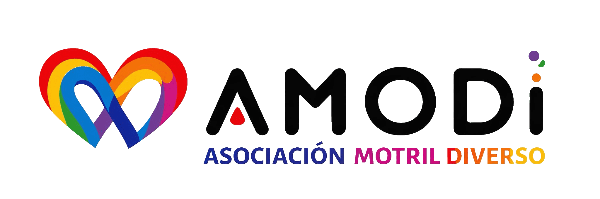

# AMODI — Asociación Motril Diverso

<p align="center" style="background: white;">
  
</p>


Landing oficial de AMODI, la Asociación Motril Diverso, una entidad LGTBIQA+ de Motril y la Costa Tropical que trabaja por la igualdad, la visibilidad, el apoyo comunitario y la defensa de los derechos.

> Por una Motril diversa, libre y orgullosa.

## Sobre AMODI

AMODI promueve y protege los derechos humanos, sociales, culturales y políticos de las personas LGTBIQA+. Su labor se centra en construir una comunidad más libre, justa y respetuosa con la diversidad afectivo-sexual, familiar y de género.

La asociación desarrolla acciones de acompañamiento, orientación, educación y sensibilización, además de colaborar con instituciones, asociaciones, centros educativos, clubes deportivos y otros colectivos locales.

## Objetivo de la landing

La web presenta la labor de AMODI y facilita que cualquier persona pueda:

- Conocer la asociación y sus principales líneas de acción.
- Consultar las actividades y eventos programados.
- Acceder a la información del Orgullo Motril 2026.
- Seguir la actualidad y las iniciativas de AMODI.
- Contactar con la asociación o solicitar información para participar.

## Contenidos

La landing está organizada en los siguientes bloques:

1. **Presentación:** mensaje principal y acceso directo a la información de AMODI y a sus próximos eventos.
2. **Quiénes somos:** propósito, ámbito de actuación y prioridades de la asociación.
3. **Líneas de acción:** apoyo y asesoramiento, sensibilización, actividades, Orgullo Motril y voluntariado.
4. **Orgullo Motril 2026:** programación, fechas destacadas y actividades de la celebración.
5. **Próximos eventos:** fecha, horario, ubicación y descripción de cada convocatoria.
6. **Actualidad:** noticias, acciones de la asociación y propuestas en defensa de los derechos LGTBIQA+.
7. **Participación y contacto:** vías para asociarse, colaborar o comunicarse con AMODI.

## Contacto

- **Dirección:** C/ Ventura nº 6, 18600 Motril, Granada
- **Correo electrónico:** [lgbtigamodi@gmail.com](mailto:lgbtigamodi@gmail.com)
- **Teléfono:** [651 857 074](tel:651857074)

## Información técnica

### Tecnologías

- [Astro](https://astro.build/)
- [Tailwind CSS](https://tailwindcss.com/)
- [Lucide](https://lucide.dev/) para la iconografía
- Fuente Dancing Script mediante Fontsource

### Requisitos

- Node.js 22.12.0 o posterior
- pnpm

### Instalación

```bash
pnpm install
```

### Desarrollo local

El servidor de desarrollo debe iniciarse en segundo plano:

```bash
pnpm astro dev --background
```

Para administrarlo:

```bash
pnpm astro dev status
pnpm astro dev logs
pnpm astro dev stop
```

La web estará disponible por defecto en `http://localhost:4321`.

### Producción

```bash
pnpm build
pnpm preview
```

La compilación se genera en el directorio `dist/`.

### Edición de contenidos

Los textos, eventos, noticias, datos de contacto y metadatos de la landing se gestionan de forma centralizada en:

```text
src/data/content.json
```

Las imágenes y otros recursos estáticos se encuentran en:

```text
public/
```

### Estructura del proyecto

```text
/
├── public/                 # Imágenes, iconos y recursos estáticos
├── src/
│   ├── components/
│   │   ├── layout/         # Cabecera y pie de página
│   │   ├── sections/       # Secciones de la landing
│   │   └── ui/             # Componentes reutilizables
│   ├── data/
│   │   └── content.json    # Contenido centralizado
│   ├── layouts/            # Estructura general y metadatos
│   ├── pages/
│   │   └── index.astro     # Página principal
│   └── styles/
│       └── global.css      # Estilos globales
├── astro.config.mjs
└── package.json
```
